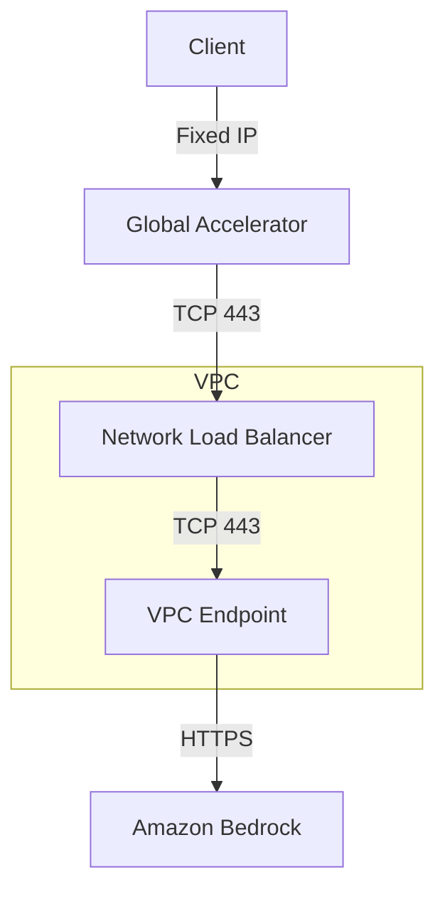

# Bedrock Accelerator CDK

This CDK project creates an infrastructure stack to accelerate Amazon Bedrock API calls by setting up VPC endpoints and a Network Load Balancer (NLB). Optionally, it can be configured with AWS Global Accelerator for improved global access.

## Architecture

The stack creates the following resources:
- Bedrock VPC Endpoint in specified subnets
- Network Load Balancer (NLB) with TCP listener
- Target Group pointing to the VPC Endpoint
- (Optional) Global Accelerator configuration
- Custom Lambda function to manage target group attachments

## Prerequisites

- Node.js (v14.x or later)
- AWS CDK CLI (`npm install -g aws-cdk`)
- AWS CLI configured with appropriate credentials
- Existing VPC with public subnets
- IAM permissions to create the required resources

## Installation

1. Clone the repository:
```bash
git clone <repository-url>
cd bedrock-accelerator
```

2. Install dependencies:
```bash
npm install
```

3. Build the project:
```bash
npm run build
```

## Configuration

Configure the stack by editing the `.env` file in the project root:

```plaintext
# VPC Configuration
VPC_ID=vpc-xxxxxxxx
PUBLIC_SUBNET_IDS=subnet-xxxxxxxx,subnet-yyyyyyyy

# Global Accelerator Configuration
ENABLE_GLOBAL_ACCELERATOR=false

# AWS Region Configuration (optional)
AWS_REGION=ap-northeast-1
```

Configuration Parameters:

| Parameter | Description | Required | Example |
|-----------|-------------|----------|---------|
| VPC_ID | ID of the VPC where resources will be created | Yes | vpc-xxxxxxxx |
| PUBLIC_SUBNET_IDS | Comma-separated list of public subnet IDs | Yes | subnet-xxx,subnet-yyy |
| ENABLE_GLOBAL_ACCELERATOR | Whether to enable Global Accelerator | No | false |
| AWS_REGION | AWS Region for deployment | No | ap-northeast-1 |

## Deployment

1. Bootstrap CDK (if not already done):
```bash
cdk bootstrap
```

2. Deploy the stack:
```bash
npm run deploy
```

3. To destroy the stack:
```bash
npm run destroy
```

## Outputs

After deployment, the stack will output:
- NLB DNS name
- (If enabled) Global Accelerator DNS name

## Security Considerations

- The NLB is internet-facing and should be properly secured
- VPC endpoints are created in public subnets as specified
- Ensure proper IAM permissions are in place
- Consider using security groups to restrict access

## Troubleshooting

1. If deployment fails with VPC-related errors:
   - Verify VPC ID and subnet IDs are correct in .env file
   - Ensure subnets have proper routing and internet access

2. If target registration fails:
   - Check if the VPC endpoint is properly created
   - Verify network interface IDs are correctly obtained

3. For Global Accelerator issues:
   - Ensure the service is available in your region
   - Verify proper IAM permissions for Global Accelerator creation

## License

ISC
# Bedrock Accelerator

A CDK project that creates a Global Accelerator setup for Amazon Bedrock, providing low-latency access through a fixed IP address.

## Architecture



## Features

- Fixed IP address through AWS Global Accelerator
- Network Load Balancer with Elastic IP
- VPC Endpoint for Amazon Bedrock
- Automatic IP registration for VPC Endpoint
- Cross-zone load balancing enabled
- Security group with proper access controls

## Prerequisites

- AWS CDK CLI
- Node.js and npm
- AWS CLI configured with appropriate credentials

## Deployment

1. Install dependencies:
```bash
npm install
```

2. Deploy the stack:
```bash
cdk deploy
```

## Stack Outputs

After deployment, the following outputs are provided:

- `VpcEndpointId`: The ID of the VPC Endpoint for Bedrock
- `LoadBalancerDNS`: The DNS name of the Network Load Balancer
- `LoadBalancerArn`: The ARN of the Network Load Balancer
- `ElasticIp`: The fixed IP address assigned to the Network Load Balancer
- `GlobalAcceleratorDNS`: The DNS name of the Global Accelerator

## Security

The stack includes the following security measures:

- VPC Endpoint security group allowing only HTTPS traffic (port 443)
- Network Load Balancer configured for TCP traffic only
- Global Accelerator configured for TCP traffic only

## Clean Up

To remove all resources:

```bash
cdk destroy
```

## Project Structure

- `lib/bedrock-accelerator-stack.ts`: Main stack containing VPC, NLB, and VPC Endpoint
- `lib/global-accelerator-stack.ts`: Nested stack for Global Accelerator configuration

## Contributing

Feel free to submit issues and enhancement requests!

## License

This project is licensed under the MIT License - see the LICENSE file for details.
