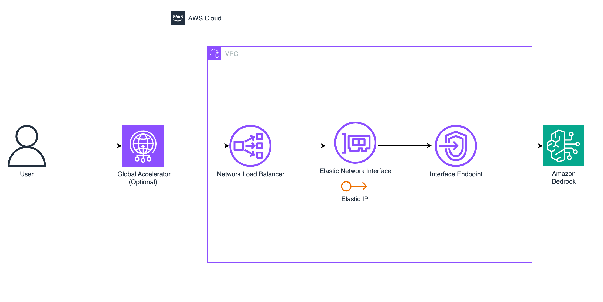

# Bedrock Accelerator CDK

This CDK project creates an infrastructure stack to accelerate Amazon Bedrock API calls by Network Load Balancer (NLB) with Elastic IP(Fixed IP). Optionally, it can be configured with AWS Global Accelerator for improved global access.

## Features

- Fixed IP address through AWS Global Accelerator
- Network Load Balancer with Elastic IP
- VPC Endpoint for Amazon Bedrock
- Automatic IP registration for VPC Endpoint
- Cross-zone load balancing enabled
- Security group with proper access controls

## Configuration

Configure the stack by editing the `.env` file in the project root:

```plaintext
# VPC Configuration
VPC_ID=vpc-xxxxxxxx
PUBLIC_SUBNET_IDS=subnet-xxxxxxxx,subnet-yyyyyyyy

# NLB Configuration
NLB_SECURITY_GROUP=0.0.0.0/0

# Global Accelerator Configuration
ENABLE_GLOBAL_ACCELERATOR=false

# AWS Region Configuration (optional)
AWS_REGION=us-east-1
```

Configuration Parameters:

| Parameter | Description | Required | Example |
|-----------|-------------|----------|---------|
| VPC_ID | ID of the VPC where resources will be created | Yes | vpc-xxxxxxxx |
| PUBLIC_SUBNET_IDS | Comma-separated list of public subnet IDs | Yes | subnet-xxx,subnet-yyy |
| NLB_SECURITY_GROUP | Restrict access to the IP range of NLB | Yes | 0.0.0.0/0 |
| ENABLE_GLOBAL_ACCELERATOR | Whether to enable Global Accelerator | No | false |
| AWS_REGION | AWS Region for deployment | No | us-east-1 |

## Deployment
1. Install dependencies:
```bash
npm install
```

2. Bootstrap CDK (if not already done):
```bash
cdk bootstrap
```

3. Deploy the stack:
```bash
npm run deploy
```

4. To destroy the stack:
```bash
npm run destroy
```

## Outputs

After deployment, the stack will output:
- NLB DNS name
- NLB Fixed IP
- (If enabled) Global Accelerator DNS name

## Troubleshooting

1. If deployment fails with VPC-related errors:
   - Verify VPC ID and subnet IDs are correct in .env file
   - Ensure subnets have proper routing and internet access

2. For Global Accelerator issues:
   - Please check the service in us-west-2 region
